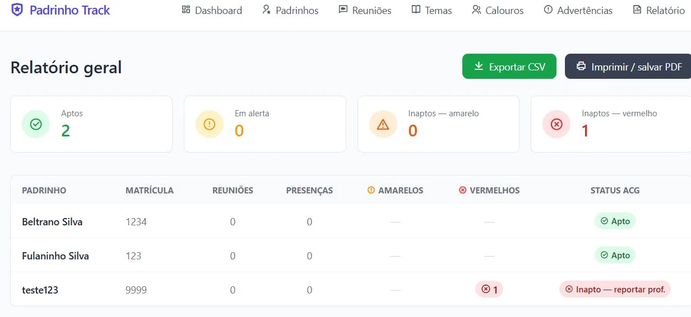

# Padrinho Track

Sistema web interno para gestão do programa de mentoria acadêmica da PUC Minas — curso de Engenharia de Software.

## Sobre o programa

Veteranos do curso (padrinhos) se inscrevem voluntariamente para acompanhar calouros ao longo do semestre. A coordenação registra presenças, controla entregas de temas e aplica o sistema de advertências que define a aptidão para recebimento de horas ACG.

## Telas

### Dashboard


### Padrinhos


### Reuniões


### Detalhe do padrinho


### Temas


### Advertências


### Relatório geral


### Modais
| Novo padrinho | Nova reunião | Novo tema | Advertência manual |
|---|---|---|---|
|  |  |  |  |

## Funcionalidades

- Cadastro de padrinhos com turno, email e telefone
- Registro de presenças por reunião com advertência automática por falta
- Controle de entrega de temas em grupo com advertência automática por atraso ou não entrega
- Advertência manual para comportamentos inadequados
- Dashboard com visão geral de status de todos os padrinhos
- Histórico individual por padrinho — presenças, temas e advertências
- Relatório geral de aptidão para ACG com exportação CSV
- Página de calouros com match padrinho-calouro completo

## Regras de advertência

| Situação | Cartão | Consequência |
|---|---|---|
| Falta sem justificativa em reunião | Amarelo | — |
| Entrega de tema com 1 dia de atraso | Amarelo | — |
| 2 amarelos | — | Inapto para ACG |
| Não entrega de tema | Vermelho | Inapto para ACG + reportar professor |
| Comportamento inadequado (manual) | Vermelho | Inapto para ACG + reportar professor |

## Stack

- **Backend:** Python + Flask
- **Banco de dados:** SQLite
- **Frontend:** HTML + Tailwind CSS + Remix Icon

## Estrutura

```
padrinho-track/
├── app.py           # Flask: configuração e rotas
├── database.py      # Conexão e criação do banco SQLite
├── models.py        # Funções de leitura e escrita no banco
├── templates/       # Páginas HTML com Tailwind
├── static/          # Arquivos estáticos
├── instance/        # Banco de dados local (não sobe pro Git)
├── docs/            # Imagens para o README
├── requirements.txt
└── README.md
```

## Como rodar

**1. Clone o repositório**
```bash
git clone https://github.com/seu-usuario/padrinho-track.git
cd padrinho-track
```

**2. Instale as dependências**
```bash
pip install -r requirements.txt
```

**3. Rode o servidor**
```bash
python app.py
```

**4. Acesse no navegador**
```
http://127.0.0.1:5000
```

O banco de dados é criado automaticamente na primeira execução dentro da pasta `instance/`.

## Dependências

```
flask>=3.0
pandas>=2.0
```