# 🎓 Padrinho Track

> Sistema web interno para gestão do programa de mentoria acadêmica da PUC Minas — Engenharia de Software.

---

## 📖 Sobre o projeto

O **Padrinho Track** nasceu de uma necessidade real: o programa de mentoria da PUC Minas não tinha forma de registrar presenças, controlar entregas ou aplicar advertências de forma organizada. Tudo ficava disperso no WhatsApp e em planilhas manuais.

O sistema centraliza a gestão de **50 padrinhos** (veteranos voluntários) e **127 calouros**, automatizando as regras de advertência que definem quem está apto a receber horas ACG ao final do semestre.

---

## 🚀 Funcionalidades

- **Dashboard** com visão geral de status — padrinhos ativos, em risco e inaptos para ACG
- **Cadastro de padrinhos** com turno, email e telefone
- **Registro de presenças** por reunião com advertência automática por falta
- **Controle de entrega de temas** com advertência automática por atraso ou não entrega
- **Advertência manual** para comportamentos inadequados relatados por calouros
- **Histórico individual** por padrinho — presenças, temas e advertências
- **Alerta preventivo** para padrinhos com 1 amarelo antes de atingir o limite
- **Relatório geral** de aptidão para ACG com exportação CSV
- **Página de calouros** com match padrinho-calouro completo
- **Sidebar colapsável e dark mode** persistidos

---

## 🟡🔴 Regras de advertência

| Situação | Cartão | Consequência |
|---|---|---|
| Falta sem justificativa em reunião | 🟡 Amarelo | — |
| Entrega de tema com 1 dia de atraso | 🟡 Amarelo | — |
| 2 amarelos acumulados | — | Inapto para ACG |
| Não entrega de tema | 🔴 Vermelho | Inapto para ACG + reportar professor |
| Comportamento inadequado (manual) | 🔴 Vermelho | Inapto para ACG + reportar professor |

---

## 🖥️ Telas

### Dashboard
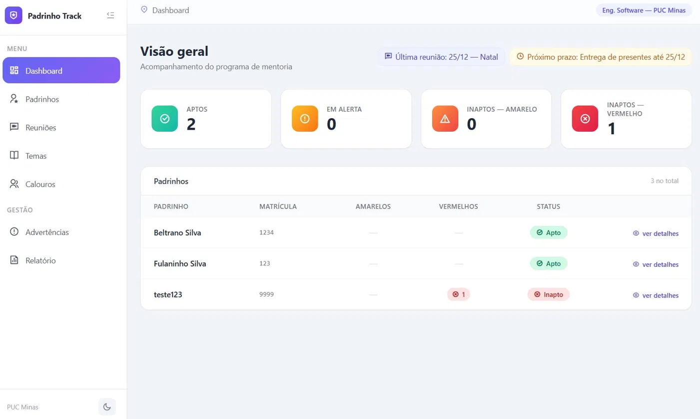

### Padrinhos
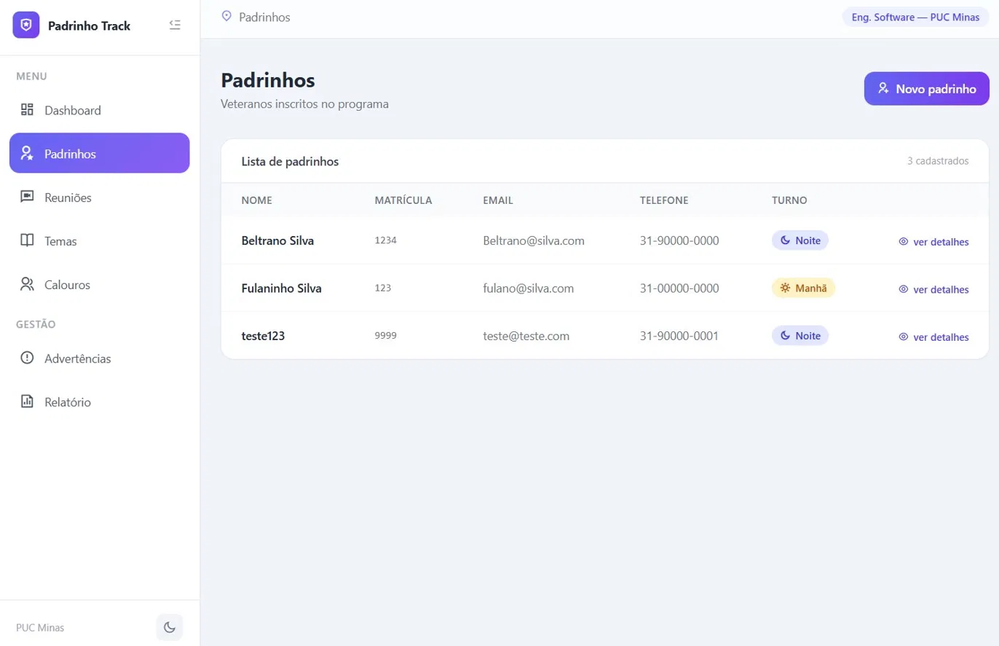

### Reuniões
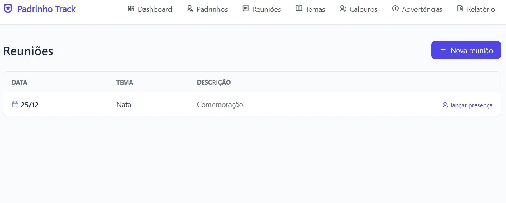

### Lançar presenças
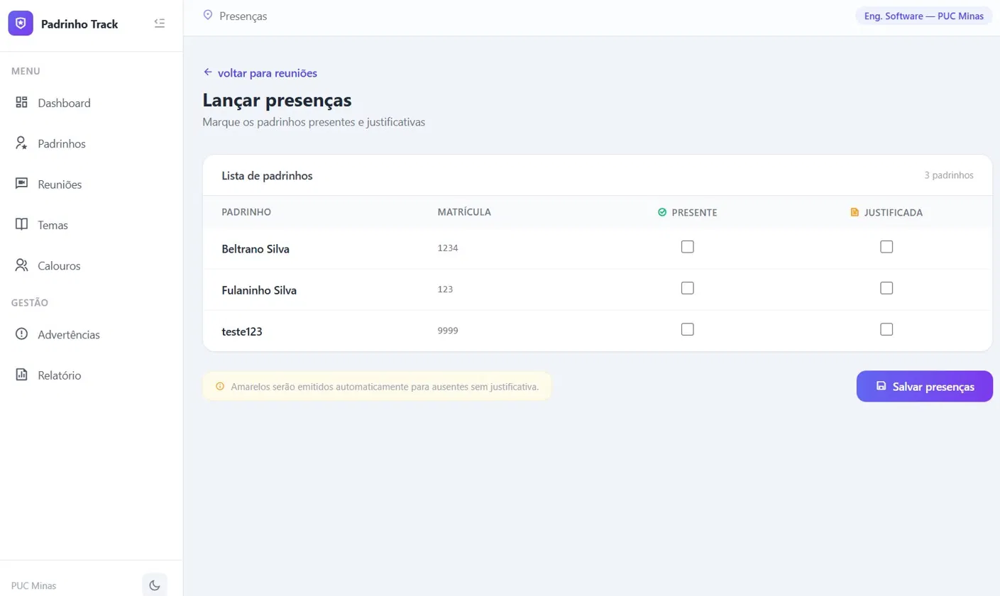

### Temas
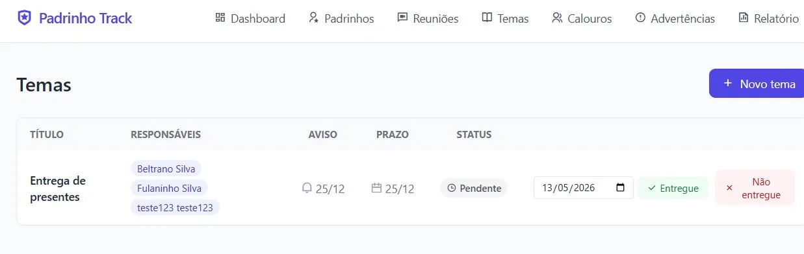

### Calouros
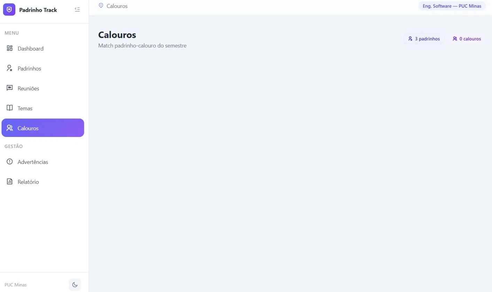

### Advertências
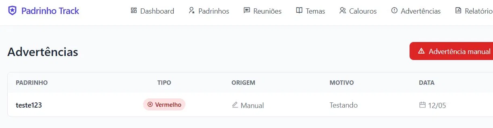

### Detalhe do padrinho
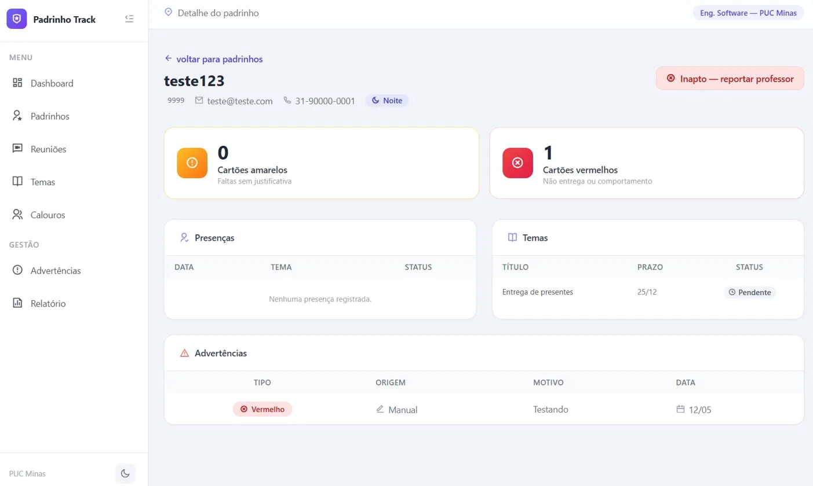

### Relatório geral — dark mode
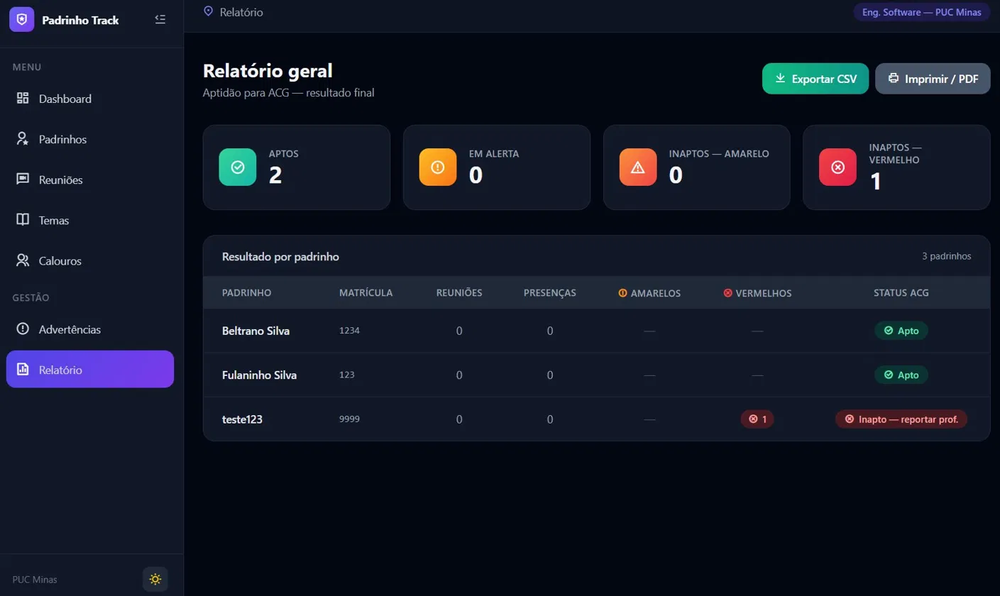

### Modais

| Novo padrinho | Nova reunião | Novo tema | Advertência manual |
|---|---|---|---|
| 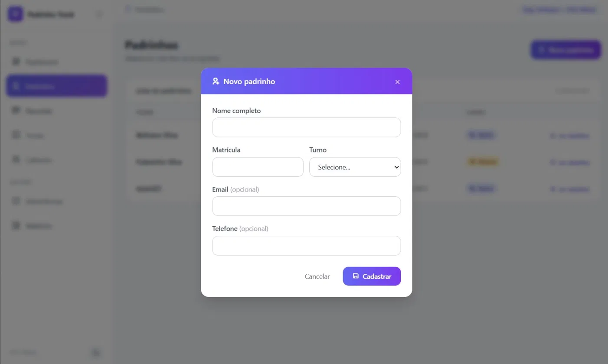 | 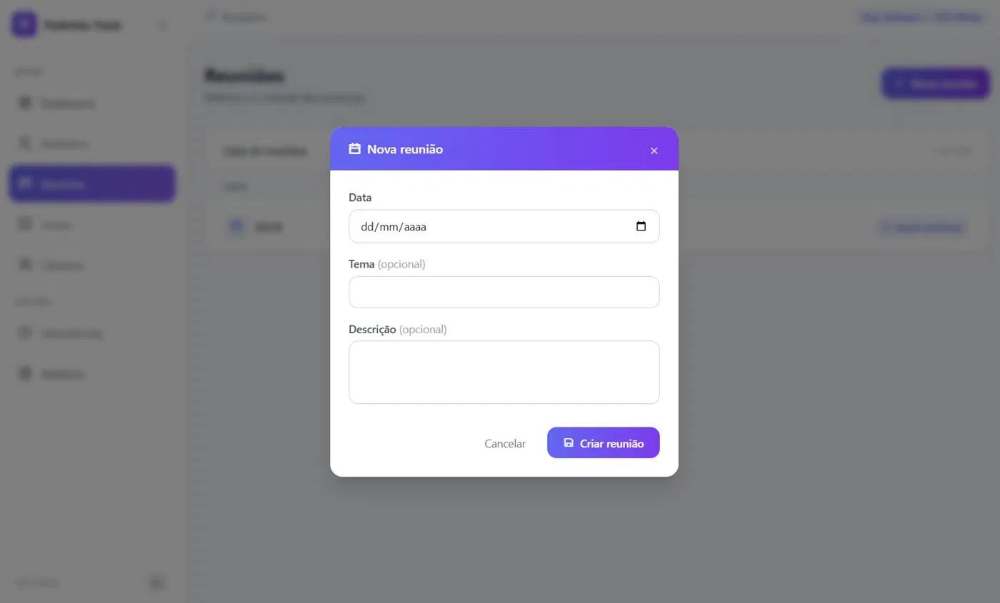 | 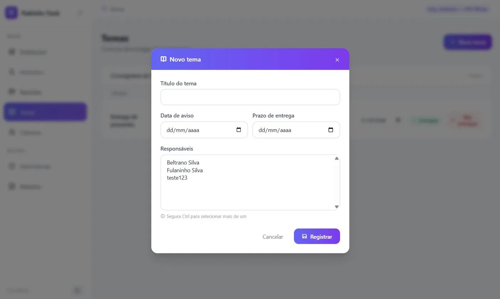 | 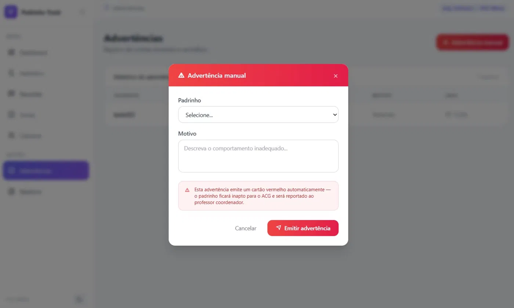 |

---

## 🛠️ Stack

- **Backend:** Python + Flask
- **Banco de dados:** SQLite
- **Frontend:** HTML + Tailwind CSS + Remix Icon
- **Testes:** pytest *(em desenvolvimento)*

---

## 📂 Estrutura

```
padrinho-track/
├── app.py           # Flask: configuração e rotas
├── database.py      # Conexão e criação do banco SQLite
├── models.py        # Funções de leitura e escrita no banco
├── templates/       # Páginas HTML com Tailwind
├── static/          # Arquivos estáticos
├── instance/        # Banco de dados local (não sobe pro Git)
├── docs/            # Screenshots para o README
├── requirements.txt
└── README.md
```

---

## ⚙️ Como rodar

**1. Clone o repositório**
```bash
git clone https://github.com/christiano-gonara/padrinho-track.git
cd padrinho-track
```

**2. Instale as dependências**
```bash
pip install -r requirements.txt
```

**3. Rode o servidor**
```bash
python app.py
```

**4. Acesse no navegador**
```
http://127.0.0.1:5000
```

> O banco de dados é criado automaticamente na primeira execução dentro da pasta `instance/`.

---

## 👤 Autor

**Christiano Gonara**
Engenharia de Software — PUC Minas
[LinkedIn](https://linkedin.com/in/christiano-gonara) · [GitHub](https://github.com/christiano-gonara)
